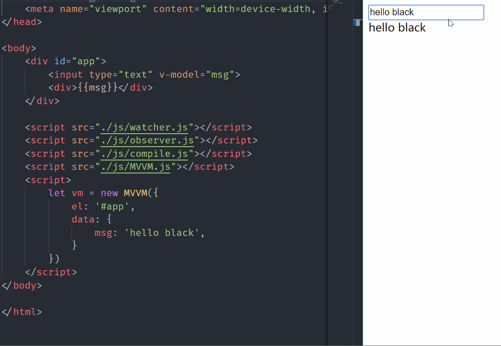
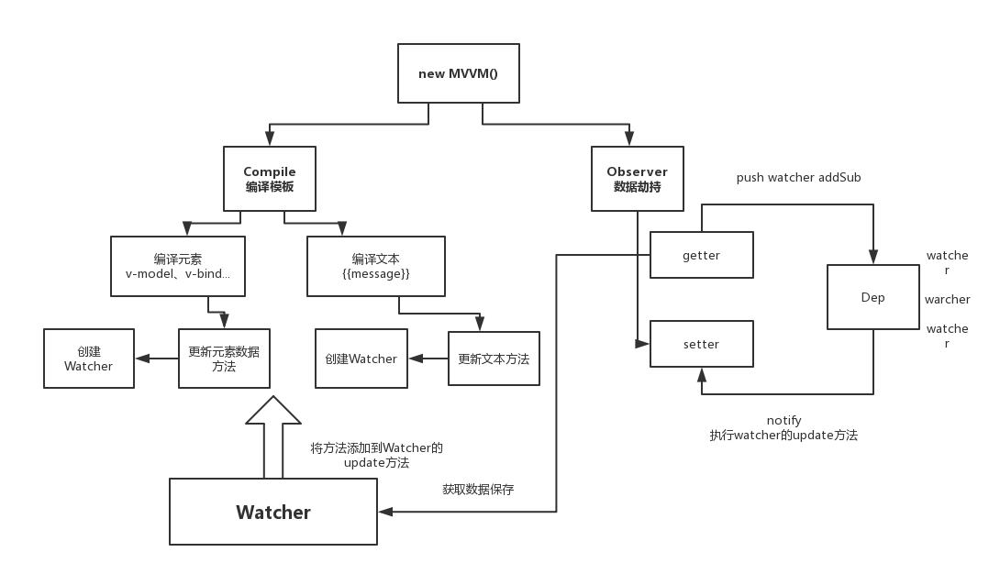

# 模拟Vue实现双向绑定

使用Vue也有一段时间了，作为一款MVVM框架，双向绑定是其最核心的部分，所以最近动手实现了一个简单的双向绑定。先上最终成果图



## 思路

实现MVVM主要包含两个方面，一个是数据变化更新视图，另一个则是对应的试图变化更新数据，重点在于怎么实现数据变了，如何去更新视图，因为视图更新数据使用事件监听的形式就可以实现，比如`input`标签通过监听`input` 事件就可以实现。所以重点是如何实现数据改变更新视图。

其实是通过`Object.defineProperty()`对属性进行数据劫持，设置`set`函数，当数据改变后就回来触发这个函数，所以要将一些需要更新的方法放在这里面就可以实现`data`更新`view`了。

## 实现功能

1. 实现一个解析器Compile，可以扫描和解析每个节点的相关指令，并根据初始化模板数据以及初始化相应的订阅器。
    1. 文本的编译 例如`{{message}}`
    2. 指令的编译 例如`v-model`
2. 实现一个监听器Observer，用来劫持并监听所有属性，如果有变动的，就通知订阅者。
3. 实现一个订阅者Watcher，可以收到属性的变化通知并执行相应的函数，从而更新视图。



## MVVM.js 整合

```javascript
class MVVM {
    constructor(options) {
		// 先把可用的东西挂载到实例上
        this.$el = options.el;
        this.$data = options.data;
        
        // 判断有没有要编译的模板
        if(this.$el) {
            // 数据劫持 将对象的所有属性，都添加 get 和 set 方法
            new Observer(this.$data)
            // 用数据和元素进行模板编译
            new Compile(this.$el, this)
        }
    }
}
```


## 模板的编译(compile.js)

```javascript
class Compile {
    constructor(el, vm) {
        // 判断el是不是元素节点
        this.el = this.isElementNode(el) ? el : document.querySelector(el); 
        this.vm = vm;
        if(this.el) {
            // 1. 先把真实的DOM移入到内存中(fragment),提高性能
            let fragment = this.node2fragment(this.el)
            // 2. 编译 -> 提取想要的元素节点 v-model 和 文本节点 {{}}
            this.compile(fragment)
            // 3. 把fragment塞回页面
            this.el.appendChild(fragment)
        }
    }
    
    // 对fragment进行编译
    compile(fragment) {
		let childNodes = fragment.childNodes;
         Array.from(childNodes).forEach( node => {
			// 遍历fragment的元素节点
             if(this.isElemenrNode(node)) {
                 // 是元素节点，需要深度递归检查
                 this.compile(node)
                 // 编译元素
                 this.compileElement(node)
             } else {
                 // 是文本节点，编译文本
                 this.compileText(node)
             }
         })
    }
}
```

## 将数据进行劫持，添加get 和 set方法

```javascript
class Observer {
    constructor(data) {
        this.observe(data)
    }
    observe(data) {
        // 要对data数据的所有属性都改为set 和 get 的形式
        if(!data || typeof data === 'object') {
            return ;
        }
        // 取出对象 key 值
        Object.keys(data).forEach( key => {
			// 数据劫持
            this.defineReactive(data, key, data[key]);
            this.observe(data[key]); // 递归劫持
        })
    }
    
    // 定义响应式（数据劫持）
    defineReactive(obj, key, value) {
        let that = this;
        Object.defineProperty(obj, key, {
            enumerable: true, // 可枚举
            configurable: true, // 属性能够被改变
            get() { // 取值时调用的方法
                return value;
            },
            set(newVal) { // 当给data属性中设置值的时候，更改获取的属性的值
                if(newVal !== value) {
			       value = newVal;
                    that.observe(newVal); // 如果是对象修改继续劫持
                }
            }
        })
    }
}
```

## 观察者（watcher.js）

最后，给需要变化的元素添加一个观察者，通过观察者监听数据变化之后执行对应的方法。

```javascript
class Watcher {
    constructor (vm, expr, cb) {
        this.vm = vm;
        this.expr = expr;
        this.cb = cb;
        // 先获取一下老值
        this.value = this.get()
    }
    getVal() {
		// 获取实例上对应的数据
        expr = expr.split('.');
        return expr.reduce( (prev, next) => {
            return prev[next];
        }, vm.$data)
    }
    get() {
		let value = this.getVal(this.vm, this.expr);
         return value;
    }
    // 对外暴露的方法，老值和新值比对，如果变化
    update() {
        let newVal = this.getVal(this.vm, this.expr);
        let oldVal = this.value;
        if(newVal !== oldVal) {
			this.cb(newVal); // 对应watch的callback
        }
    }
}
```

Watch 完成，需要new一下调用，首先需要在模板编译的时候需要调用，在`compile.js`：

```javascript
CompileUtil = {
    getVal(vm, expr) {
        // 获取实例上对应的数据
        expr = expr.split('.');
        return expr.reduce( (prev, next) => {
            return prev[next];
        }, vm.$data)
    },
    getTextVal(vm, expr) {
        // 获取编译后文本的结果 
        return expr.replace(/\{\{([^}]+)\}\}/g, (...arguments) => {
            return this.getVal(vm, arguments[1]);
        })
    },
    text(node, vm, expr) {
        // 文本处理
        let updateFn = this.updater['textUpdater']
		/*  Wather观察者监听  */
        expr.replace(/\{\{([^}]+)\}\}/g, (...arguments) => {
            new Wathcer(vm, arguments[1], (newVal) => {
                // 如果数据变化，文本需要重新获取依赖的数据，更新文本中的内容
                updateFn && updateFn(node, this.getTextVal(vm, expr))
            })
        })

        updateFn && updateFn(node, this.getTextVal(vm, expr))
    },
    setVal(vm, expr, value) {
        expr = expr.split('.');
        return expr.reduce( (prev, next,currentIndex) => {
            if(currentIndex === expr.length - 1) {
                return prev[next] = value;
            }
            return prev[next];
        }, vm.$data)
    },

    model(node, vm, expr) {
        // 输入框处理
        let updateFn = this.updater['modelUpdater']
		/*  Wather观察者监听  */
        // 这里应该加一个监控， 数据变化，调用watch的回调
        new Wathcer(vm, expr, (newVal) => {
            // 当值变化后会调用callback，将新值传递过来
            updateFn && updateFn(node, this.getVal(vm, expr));
        })
	    // 给输入框加上input事件监听
        node.addEventListener('input', (e) => {
            let newVal = e.target.value;
            this.setVal(vm, expr, newVal)
        })      

        updateFn && updateFn(node, this.getVal(vm, expr));
    },
    updater: {
        // 文本更新
        textUpdater(node, value) {
            node.textContent = value;
        },
        // 输入框更新
        modelUpdater(node, value) {
            node.value = value;
        }
    }
}
```

但是此时有一个问题，Watcher没有地方调用，更新函数不会执行，所以此时需要一个发布订阅模式来调用监控者。

```javascript
class Dep {
    constructor() {
        // 订阅的数组
        this.subs = [];
    }
    addSub(watcher) {
        this.subs.push(watcher);
    }
    notify() {
        this.subs.forEach( watcher => {
            watcher.update()
        })
    }
}
```

此时需要修改`watcher`里 `get()` 这个方法：

```javascript
get() {
	Dep.target = this;
    let value = this.getVal(this.vm, this.expr)
    Dep.target = null;
    return value;
}
```

此时要得到对象的值，需要被数据劫持拦截：

```javascript
defineReactive(obj, key, value) {
    let that = this;
    let dep = new Dep();  // 每个变化的数据，都会定义一个数组，这个数组存放所有更新的操作
    Object.defineProperty(obj, key, {
        enumerable: true, // 可枚举
        configurable: true,
        get() { 
            // 当取值时调用的方法
            Dep.target && dep.addSub(Dep.target); // 最开始编译的时候不会执行
            return value;
        },
        set(newVal) {
            // 当给data属性中设置值的时候 更改获取属性的值
            if(newVal != value) {
                that.observe(newVal); // 如果是对象继续劫持
                value = newVal;
                dep.notify(); // 通知所有人数据更新了
            }
        }
    });
}
```

此时就完成了输入框的双向绑定。不过此时我们取数据是以`vm.$data.msg`来取到数据，理想情况我们是`vm.msg`来取到数据，为了实现这样的形式，我们使用`proxy`进行一下代理实现：

```javascript
    proxyData(data) {
        Object.keys(data).forEach( key => {
            Object.defineProperty(this, key, {
                get() {
                    return data[key]
                },
                set(newVal) {
                    data[key] = newVal
                }
            })
        })
    }
```

这下我们就可以直接通过`vm.msg = 'hello'`的形式来进行改变和获取模板数据了。