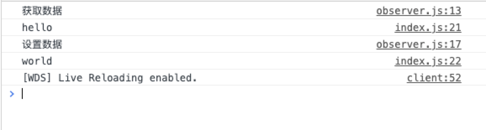

# 从0实现简版Vue --- （1）

## 1. 工欲善其事，必先利其器，首先搭建我们的开发环境


首先使用`npm init -y` 创建初始化的配置文件，然后下载一下我们后面需要的开发依赖：

`npm i webpack webpack-cli webpack-dev-server html-webpack-plugin --save-dev`


新建 `webpack.config.js` 用来编写`webpack`配置, 新建`src/index.js`做为项目入口文件，然后新建`public/index.html`做为模板文件。`webpack` 基本配置内容如下：

```javascript
const path = require('path');
const htmlWebpackPlugin = require('html-webpack-plugin');
module.exports = {
  entry: './src/index.js', // 以我们src 的index.js为入口进行打包
  output: {
    filename: 'bundle.js',
    path: path.resolve(__dirname, 'dist')
  },
  devtool: 'source-map',
  resolve: {
    // 默认让import去我们的source文件夹去查找模块，其次去node_modules查找
    modules: [path.resolve(__dirname, 'source'), path.resolve('node_modules')]
  },
  plugins: [
    new htmlWebpackPlugin({
      template: path.resolve(__dirname, 'public/index.html')
    })
  ]
}
```


使用`npm scripts`启动我们的项目, 将 `package.json`里面的`scripts`修改为：

```json
"scripts": {
  "start": "webpack-dev-server",
  "build": "webpack"
}
```


然后执行`npm start`可启动我们的项目了。


## 2. 创建我们的基本框架

上面修改了我们的默认引入文件路径，此时我们在`source` 文件夹下新建`vue/index.js`，然后在我们的`src/index.js`中引入

```javascript
import Vue from 'vue'; // 会默认查找 source 目录下的 vue 文件夹
```

此时在`source/vue/index.js` 的`js`就可以正常执行了。

下面继续编写我们的`src/index.js`，前面已经引入了我们自己编写的`Vue`,后面我们模拟`Vue`的语法去编写：

```javascript
import Vue from 'vue'; // 会默认查找 source 目录下的 vue 文件夹

let vm = new Vue({
  el: '#app', // 表示要渲染的元素是#app
  data() {
    return {
      msg: 'hello',
      school: {
        name: 'black',
        age: 18
      },
      arr: [1, 2, 3],
    }
  },
  computed: {
  },
  watch: {
  }
});
```


接着我们就要去编写实现我们 `Vue` 代码了， `vue/index.js`：

```javascript
import {initState} from './observe';

function Vue(options) { // Vue 中原始用户传入的数据
  this._init(options); // 初始化 Vue， 并且将用户选项传入
}

Vue.prototype._init = function(options) {
  // vue 中的初始化 this.$options 表示 Vue 中的参数
  let vm = this;
  vm.$options = options;

  // MVVM 原理， 需要数据重新初始化
  initState(vm);
}

export default Vue; // 首先默认导出一个Vue
```


首先我们需要去初始化`Vue`，将用户传入的数据进行初始化处理，新建`observe/index.js`去实现用户传入数据的初始化：

```javascript
export function initState(vm) {
  let opts = vm.$options;
  if (opts.data) {
    initData(vm); // 初始化数据
  }
  if (opts.computed) {
    initComputed(); // 初始化计算属性
  }
  if (opts.watch) {
    initWatch(); // 初始化 watch
  }
}

/**
 * 初始化数据
 * 将用户传入的数据 通过Object.defineProperty重新定义
 */
function initData(vm) {
}

/**
 * 初始化计算属性
 */
function initComputed() {
}

/**
 * 初始化watch
 */
function initWatch() {
} 
```

## 3. 数据的初始化

首先我们去实现用户传入的`data`的初始化，也就是经常提到的使用`Object.defineProperty`进行数据劫持，重写`getter`

和`setter`，下面去实现 `initData`的具体内容：

```javascript
/**
 * 将对vm上的取值、赋值操作代理到 vm._data 属性上
 * 代理数据 实现 例如：vm.msg = vm._data.msg
 */
function proxy(vm, source, key) {
  Object.defineProperty(vm, key, {
    get() {
      return vm[source][key];
    },
    set(newValue) {
      vm[source][key] = newValue;
    }
  })
}

/**
 * 初始化数据
 * 将用户传入的数据 通过Object.defineProperty重新定义
 */
function initData(vm) {
  let data = vm.$options.data; // 用户传入的data
  data = vm._data = typeof data === 'function' ? data.call(vm) : data || {};

  for(let key in data) {
    proxy(vm, '_data', key); // 将对vm上的取值、赋值操作代理到 vm._data 属性上，便于我们直接使用vm取值
  }

  observe(vm._data); // 观察数据
}

export function observe(data) {
  if(typeof data !== 'object' || data == null) {
    return; // 不是对象或为null 不执行后续逻辑
  }
  return new Observer(data);
}
```

## 4. 数据劫持核心方法实现

我们去该目录下新建`observer.js`去实现我们的`Observer`：

```javascript
import {observe} from './index';

/**
 * 定义响应式的数据变化
 * @param {Object} data  用户传入的data
 * @param {string} key data的key
 * @param {*} value data对应key的value
 */
export function defineReactive(data, key, value) {
  observe(value);   // 如果value依旧是一个对象，需要深度劫持
  Object.defineProperty(data, key, {
    get() {
      console.log('获取数据');
      return value;
    },
    set(newValue) {
      console.log('设置数据');
      if (newValue === value) return;
      value = newValue;
    }
  });
}

class Observer {
  constructor(data) { // data === vm._data
    // 将用户的数据使用 Object.defineProperty重新定义
    this.walk(data);
  }

  /**
   * 循环数据遍历
   */
  walk(data) {
    let keys = Object.keys(data);
    for(let i = 0; i < keys.length; i++) {
      let key = keys[i];
      let value = data[key];
      defineReactive(data, key, value);
    }
  }
}

export default Observer; 
```

## 5. 结果

到这我们就初步实现了对用户传入`data`的数据劫持，看一下效果。

此时如果我们在`src/index.js`去取和修改`data`中的值：

```javascript
console.log(vm.msg);
console.log(vm.msg = 'world');
```



到现在为止我们就实现了第一部分，对用户数据传入的`data`进行了数据劫持，但是如果我们使用`vm.arr.push(123)`，会发现只有获取数据而没有设置数据，这也就是`Object.defineProperty`的弊端，没有实现对数组的劫持，下一部分去实现一下数据的数据劫持。

