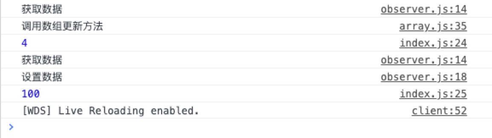

## 数组劫持的实现

## 1. 数组原生方法的劫持

前面已经完成了对`data`数据里对象的劫持，但是针对数组的变化，`Object.defineProperty` 不能很好的支持，所以在`Vue` 中，采取了对数组原生方法进行劫持的操作，来保证数据可以被正常监测到。

由于原来的方法不能正常对数组进行数据劫持，所以我们要对data的数据类型进行区分，所以我们需要改写`Observer`类：

```javascript
class Observer {
  constructor(data) { // data === vm._data
    // 将用户的数据使用 Object.defineProperty重新定义
    if (Array.isArray(data)) {
      // 对数组方法进行劫持, 让数组通过链来查找我们自己改写的原型方法
      data.__proto__ = arrayMethods;
    } else {
      this.walk(data);
    }
  }
  
	// ...
}
```

通过使用`data.__proto__`将数组上的方法换成我们改写的原型方法 `arrayMethods`，我们新建一个`array.js`来重写我们的数组方法。

```javascript
/**
 * 拦截用户调用的push、shift、unshift、pop、reverse、sort、splice数组方法
 */

// 获取老的数组方法
let oldArrayProtoMethods = Array.prototype;

// 拷贝新的对象，用来查找老的方法, 不修改原型上的方法
export let arrayMethods = Object.create(oldArrayProtoMethods);

let methods = [
  'push',
  'pop',
  'unshift',
  'shift',
  'sort',
  'splice'
];

methods.forEach(method => {
  arrayMethods[method] = function(...args) { // 函数劫持
    let result = oldArrayProtoMethods[method].apply(this, args);
    console.log('调用数组更新方法');
    return result;
  }
}); 
```

此时我们去调用`vm.arr.push(1, 2, 3)`会打印*调用数组更新方法*，说明此时的`push`方法是调用的我们重写的方法。


## 2. 数组新增对象进行监测

如果我们调用`vm.arr.push({a: 1})`，那我们也需要对数组新增的对象属性进行监测，也就是需要添加`observe`观测，所以还需要进一步改写数组的方法：

```javascript
/**
 * 对数组新增的元素进行劫持
 * @param {*} inserted 
 */
+export function observerArray(inserted) {
+  for (let i = 0; i < inserted.length; i++){
+    observe(inserted[i]); // 还需要对数组里面的内容进行监测
+  }
+}

methods.forEach(method => {
  arrayMethods[method] = function(...args) { // 函数劫持
    let result = oldArrayProtoMethods[method].apply(this, args);
    console.log('调用数组更新方法');
+    let inserted;
+    switch (method) {
+      case 'push':
+      case 'unshift':
+        inserted = args;
+        break;
+      case 'splice':
+        inserted = args.slice(2); // 获取splice(start, deleteCount, []）新增的内容
+      default:
+        break;
+    }
+    if(inserted) observerArray(inserted);
    return result;
  }
}); 
```


## 3. 结果

此时如果我们数组添加一个对象并且修改对象的值都可以正常被监测到：

```javascript
console.log(vm.arr.push({a: 1}));
console.log(vm.arr[3].a = 100);
```

此时浏览器会打印：




到这我们的数组劫持也实现了，下一部分我们去实现如何将数据通过模板的方式替换到页面并同步改变。


