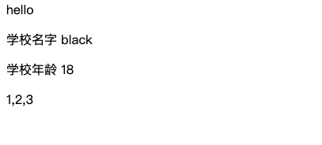

# 模板编译

## 1. 如果有el，去调用$mount方法

在前面对数据进行`inintState`之后，如果用户配置了`el`属性，会通过调用`$mount`方法，将数据渲染到页面上，此时：

```javascript
Vue.prototype._init = function(options) {
  // vue 中的初始化 this.$options 表示 Vue 中的参数
  let vm = this;
  vm.$options = options;

  // MVVM 原理， 需要数据重新初始化
  initState(vm);

+  if (vm.$options.el) {
+    vm.$mount();
+  }
}
```


### $mount

此时的`$mount`需要做两件事：

1. 通过用户配置的`el`字段，获取DOM元素，并将该元素挂载到`vm.$el`字段上；
2. 通过实例化一个渲染 `Watcher`，去进行页面渲染；

```javascript
function query(el) {
  if (typeof el === 'string') {
    return document.querySelector(el);
  };
  return el;
}

// 渲染页面 将组件进行挂载
Vue.prototype.$mount = function () {
  let vm = this;
  let el = vm.$options.el; // 获取元素
  el = vm.$el = query(el); // 获取当前挂载的节点 vm.$el 就是我要挂在的一个元素

  // 渲染通过 watcher来渲染
  let updateComponent = () => { // 更新、渲染的逻辑
    vm._update(); // 更新组件
  }
  new Watcher(vm, updateComponent); // 渲染Watcher, 默认第一次会调用updateComponent
}
```

这里会生成一个渲染`Watcher`的实例。下面先简单实现一下这个`Watcher`类，在`observe`目录下新建`watcher.js`：

```javascript
let id = 0; // Watcher 唯一标识

class Watcher { // 每次产生一个watch 都会有一个唯一的标识
  /**
   * 
   * @param {*} vm 当前逐渐的实例 new Vue 
   * @param {*} exprOrFn 用户可能传入的一个表达式 也可能传入一个函数
   * @param {*} cb 用户传入的回调函数 vm.$watch('msg', cb) 
   * @param {*} opts 一些其他参数
   */
  constructor(vm, exprOrFn, cb = () => {}, opts = {}) {
    this.vm = vm;
    this.exprOrFn = exprOrFn;
    if (typeof exprOrFn === 'function') {
      this.getter = exprOrFn;
    }
    this.cb = cb;
    this.opts = opts;
    this.id = id++;
    this.get();
  }
  get() {
    this.getter(); // 让传入的函数执行
  }
}
export default Watcher; 

```

根据现在的`Watcher`实现，新生成这个渲染`Watcher`的实例，会默认去执行`UpdateComponent`方法，也就是去执行`vm._update`方法，下面我们去看一下`_update`方法的实现。


## 2. _update

`_update`方法主要实现页面更新，将编译后的DOM插入到对应节点中，这里我们暂时先不引入虚拟DOM的方式，我们首先用一种较简单的方式去实现文本渲染。

首先使用`createDocumentFragment`把所有节点都剪贴到内存中，然后编译内存中的文档碎片。

```javascript
Vue.prototype._update = function() {
  let vm = this;
  let el = vm.$el;

  /** TODO 虚拟DOM重写 */
  // 匹配 {{}} 替换
  let node = document.createDocumentFragment();
  let firstChild;
  while(firstChild = el.firstChild) {
    node.appendChild(firstChild);
  }

  compiler(node, vm); // 编译节点内容 匹配 {{}} 文本，替换为变量的值

  el.appendChild(node);
}
```

下面我们去实现`compiler`方法：

## 3. Compiler 方法实现

```javascript
const defaultRE = /\{\{((?:.|\r?\n)+?)\}\}/g;
export const util = {
  getValue(vm, expr) { // school.name
    let keys = expr.split('.');
    return keys.reduce((memo, current) => {
      memo = memo[current]; // 相当于 memo = vm.school.name
      return memo;
    }, vm);
  },
  /**
   * 编译文本 替换{{}}
   */
  compilerText(node, vm) {
    node.textContent = node.textContent.replace(defaultRE, function(...args) {
      return util.getValue(vm, args[1]);
    });
  }
}

/**
 * 文本编译
 */
export function compiler(node, vm) {
  let childNodes = node.childNodes;
  [...childNodes].forEach(child => { // 一种是元素一种是文本
    if (child.nodeType == 1) { // 1表示元素
      compiler(child, vm); // 如果子元素还是非文本， 递归编译当前元素的孩子节点
    } else if (child.nodeType == 3) { //  3表示文本
      util.compilerText(child, vm);
    }
  })
} 
```

好了到现在我们的节点编译方法也实现了，我们去看下页面效果，将 `index.html`修改为`Vue`模板的形式：

```html
<div id="app">
  {{msg}}
  <div>
    <p>学校名字 {{school.name}}</p>
    <p>学校年龄 {{school.age}}</p>
  </div>
  <div>{{arr}}</div>
</div>
```

可以看到页面展示：



说明我们的变量被正常渲染到页面上了，但是我们去修改变量的值，发现页面不能正常更新，别急，下一部分我们去搞定依赖收集去更新视图。


代码部分可看[本次提交commit ](https://github.com/blackhu0804/simple-vue/commit/42f7c322c55cccd19e84d11acf20498e74c69aa2)

